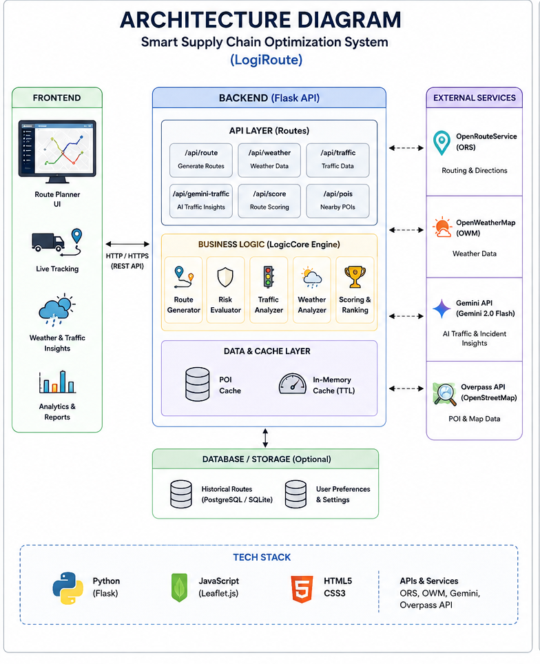
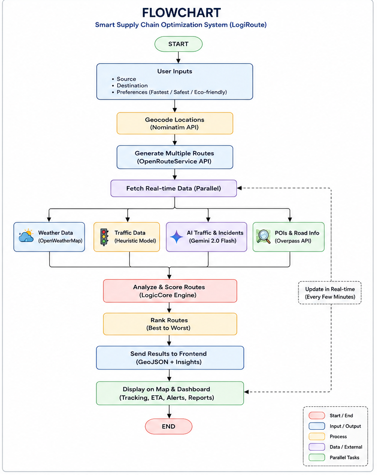

# 🚀 Smart Supply Chain Optimization System (LogiRoute)

> AI-powered Logistics Optimization & Real-Time Route Intelligence Platform

---

## 📌 Overview

**LogiRoute** is a full-stack intelligent logistics system designed to optimize delivery routes using real-time data, AI-driven traffic insights, and multi-factor decision logic.

It acts as a **LogicCore engine** that combines route generation, traffic prediction, weather analysis, and risk scoring to deliver the most efficient, safe, and cost-effective routes.

---

## 🧠 Key Features

### 🚚 Smart Route Optimization
- Generates multiple alternative routes  
- Uses OpenRouteService for navigation  
- Removes duplicate routes  

### 🌦 Weather-Aware Routing
- Integrates OpenWeather API  
- Calculates weather risk score  
- Considers rain, wind, and visibility  

### 🚦 AI-Powered Traffic Intelligence
- Uses Gemini API  
- Predicts congestion, delays, and incidents  

### ⚠️ LogicCore Decision Engine
- Combines:
  - Traffic  
  - Weather  
  - Distance  
  - Road conditions  
- Produces optimized route ranking  

### 📍 Live Tracking Dashboard
- ETA calculation  
- Delivery tracking  
- Alerts and updates  

### 🛠 POI Detection
- Detects fuel stations, garages, food stops  
- Uses OpenStreetMap (Overpass API)  

---

## 🏗 System Architecture



---

## 🔄 Workflow



---

## ⚙️ Tech Stack

### 💻 Frontend
- HTML5, CSS3  
- JavaScript  
- Leaflet.js  

### ⚙️ Backend
- Python (Flask)  
- REST APIs  

### 🌐 APIs Used
- OpenRouteService  
- OpenWeatherMap  
- Gemini API  
- OpenStreetMap Overpass API  

---

## 📂 Project Structure

```
smart-supply-chain/
│
├── frontend/
│   ├── index.html
│   ├── css/
│   ├── js/
│   └── assets/
│
├── backend/
│   ├── app.py
│   ├── services/
│   └── utils/
│
├── docs/
│   ├── architecture.png
│   ├── flowchart.png
│   └── screenshots/
│
├── .env.example
├── .gitignore
├── requirements.txt
└── README.md
```

---

## 🔑 Setup Instructions

### 1. Clone Repository
git clone https://github.com/your-username/smart-supply-chain.git  
cd smart-supply-chain  

### 2. Install Dependencies
pip install -r requirements.txt  

### 3. Setup Environment Variables

Create `.env` file:

ORS_KEY=your_openrouteservice_key  
OWM_KEY=your_openweather_key  
GEMINI_KEY=your_gemini_api_key  

---

### 4. Run Backend
python app.py  

---

### 5. Run Frontend
Open `frontend/index.html` in your browser.

---

## 📡 API Endpoints

- /api/routes → Generate routes  
- /api/weather → Weather data  
- /api/gemini-traffic → AI traffic insights  
- /api/pois → POI data  

---

## 🧠 LogicCore Engine

Score = f(Traffic, Weather, Distance, Duration, Risk Factors)

Each route is evaluated, scored, and ranked.

---

## 🚀 Future Enhancements

- Mobile app integration  
- IoT-based GPS tracking  
- Machine learning-based route prediction  
- Power BI analytics dashboard  
- Cloud deployment  

---

## 🔐 Security Notes

- Do NOT upload `.env`  
- Use `.env.example`  
- Rotate API keys if exposed  

---

## 📜 License

CC0-1.0 License

---

## 👨‍💻 Author

**Neel Raval**  
Electronics & Communication Engineer  
Embedded Systems | VLSI | AI Systems  

---

